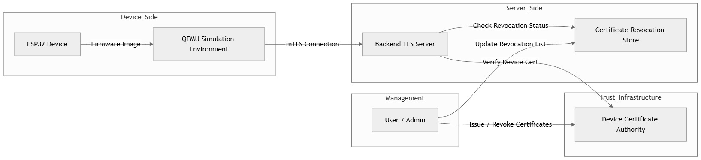
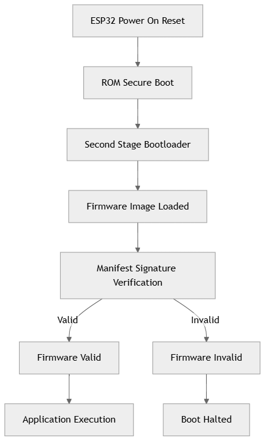
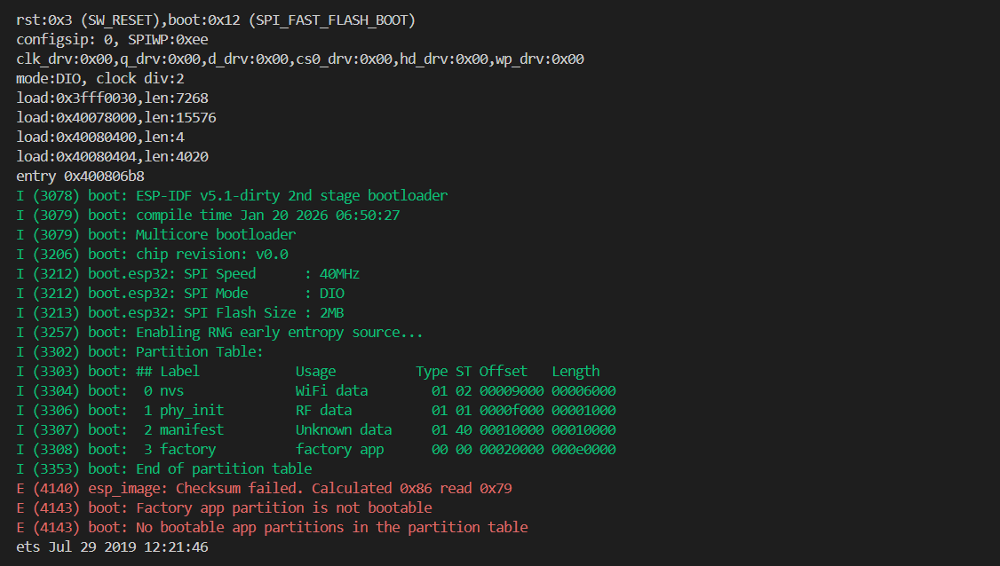
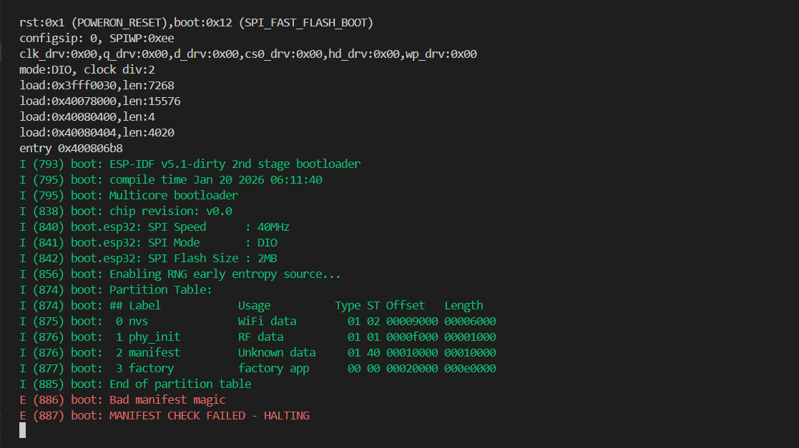
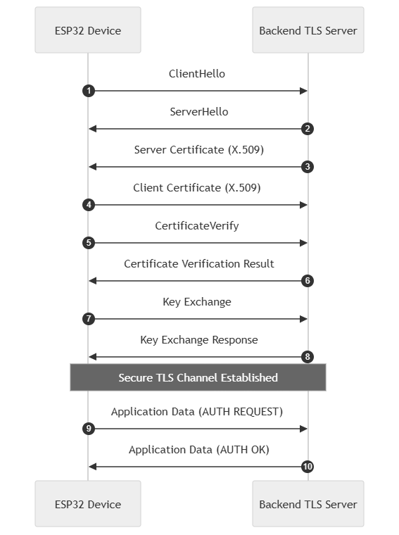
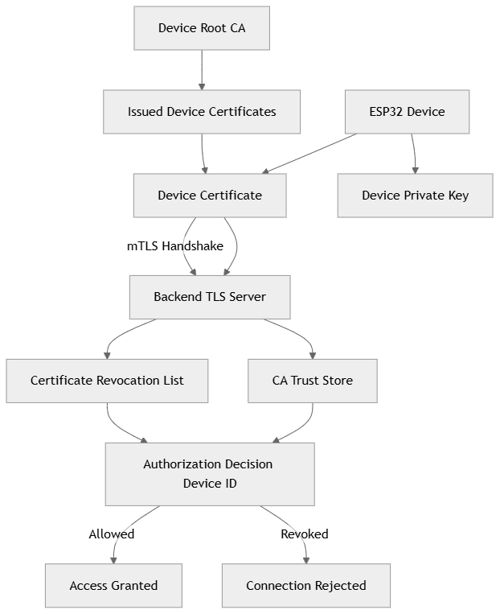
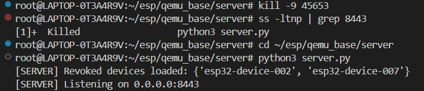
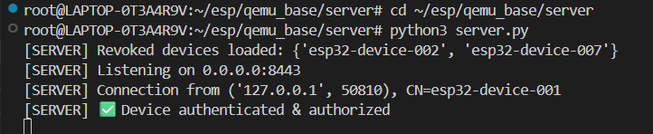
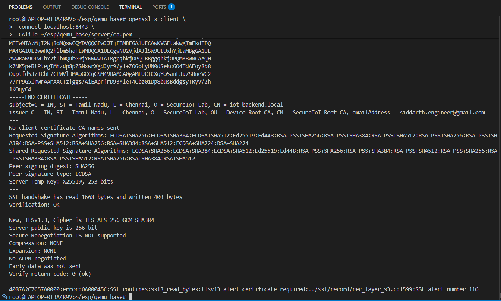
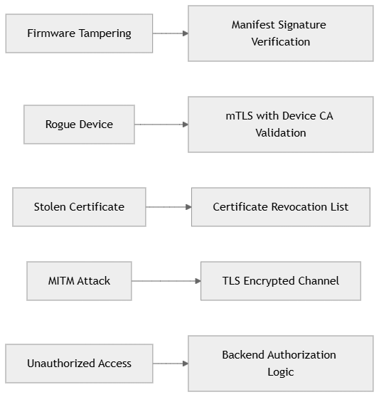

# 🔐 Secure IoT Firmware & Device Authentication System  
### Secure Boot · Firmware Integrity · mTLS · Device Revocation  
**ESP32 + QEMU + Backend TLS Server**

---

## 🧠 End-to-End System Architecture

  

> **Figure:** Overall system architecture showing ESP32 secure boot, firmware verification, mutual TLS authentication, certificate authority, revocation control, and backend authorization.

---

## 👤 Author

**Siddarth S**

  

---

## 📌 Project Overview

This project implements an **end-to-end secure IoT architecture** that protects an ESP32-class device from:

- Firmware tampering  
- Rogue or cloned devices  
- Stolen certificates  
- Man-in-the-Middle (MITM) attacks  
- Unauthorized backend access  

The system combines:

- **Secure Boot & Root of Trust**
- **Firmware Manifest Signature Verification**
- **Mutual TLS (mTLS) Authentication**
- **Certificate Revocation & Authorization Logic**

All security mechanisms are validated using **QEMU-based ESP32 simulation** and a **real TLS backend server**.

---

## 🔒 Secure Boot & Trust Chain

  

### Boot Sequence
1. ESP32 Power-On Reset  
2. ROM Secure Boot (Root of Trust)  
3. Second-Stage Bootloader  
4. Firmware Image Loaded  
5. Manifest Signature Verification  

- ✅ **Valid firmware** → Application executes  
- ❌ **Invalid firmware** → Boot halted  

This ensures **only cryptographically signed firmware can execute**, even if flash memory is modified.

---

## 🔑 Firmware Integrity Protection (QEMU Proof)

  
  

### What was tested
- A valid firmware image  
- A deliberately tampered firmware image  

### Result
- ✔ Valid firmware → Boots normally  
- ❌ Tampered firmware → Rejected during boot  

This proves **real firmware integrity enforcement**, not checksum validation.

---

## 🔐 Mutual TLS (mTLS) Authentication

  

### mTLS Handshake Flow
1. ClientHello  
2. ServerHello  
3. Server Certificate (X.509)  
4. Client Certificate (X.509)  
5. Client proves possession of private key  
6. Server verifies certificate (CA + CRL)  
7. Authorization check (CN / Device ID)  
8. Secure TLS channel established  
9. Application data exchange (`AUTH OK`)  

This guarantees **mutual authentication**, not just encrypted transport.

---

## 🪪 Certificate & Revocation Control

  

### Identity Model
- Device certificates issued by **Device Root CA**
- Backend trusts **only this CA**
- Revoked devices stored in **CRL / denylist**

### Decision Logic
- ✔ Certificate valid & not revoked → **Access granted**
- ❌ Revoked or unauthorized → **Connection rejected**

### Proof Screenshots

  
  

  

---

## 🛡️ Threat Mitigation Mapping

  

  
|         Threat         |            Mitigation            |
|------------------------|----------------------------------|
| Firmware tampering     | Manifest signature verification  |
| Rogue device           | mTLS + Device CA validation      |
| Stolen certificate     | Certificate revocation list      |
| MITM attack            | TLS encrypted channel            |
| Unauthorized access    | Backend authorization logic      |

This section explains **why each security control exists**.

---

## 🧪 Test Environment

- ESP-IDF v5.x  
- QEMU (ESP32 simulation)  
- OpenSSL (TLS server & client)  
- Python TLS backend  
- Linux / WSL environment  

> **Note:** This design can be directly extended to real ESP32 hardware.

---

## 🏁 Final conculsion 

This project demonstrates a **production-grade IoT security architecture**, covering:

- Root-of-Trust boot
- Firmware integrity
- Strong device identity
- Certificate lifecycle management
- Backend authorization control

It reflects **real-world practices used in industrial, automotive, and aerospace**